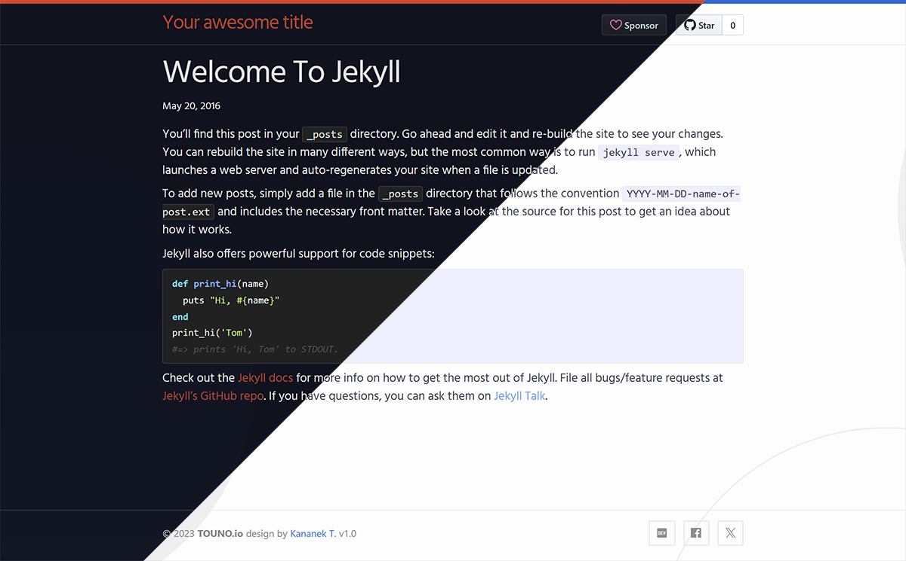

  <h1>Minima-lite</h1>
  

    
    
    
  

  
It's Jekyll's theme. It's what you get when you run <strong>Fork: </strong><a href="https://github.com/jekyll/minima">jekyll minima</a>

<a href="https://dvgamerr.github.io/minima-lite/">Theme preview</a>

# License
The theme is available as open source under the terms of the MIT License.
